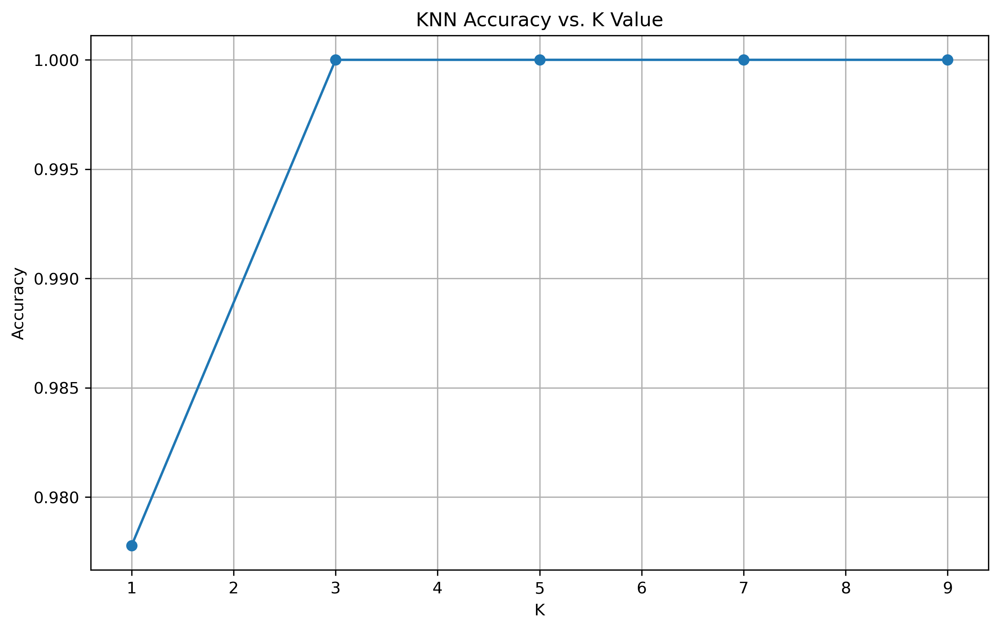
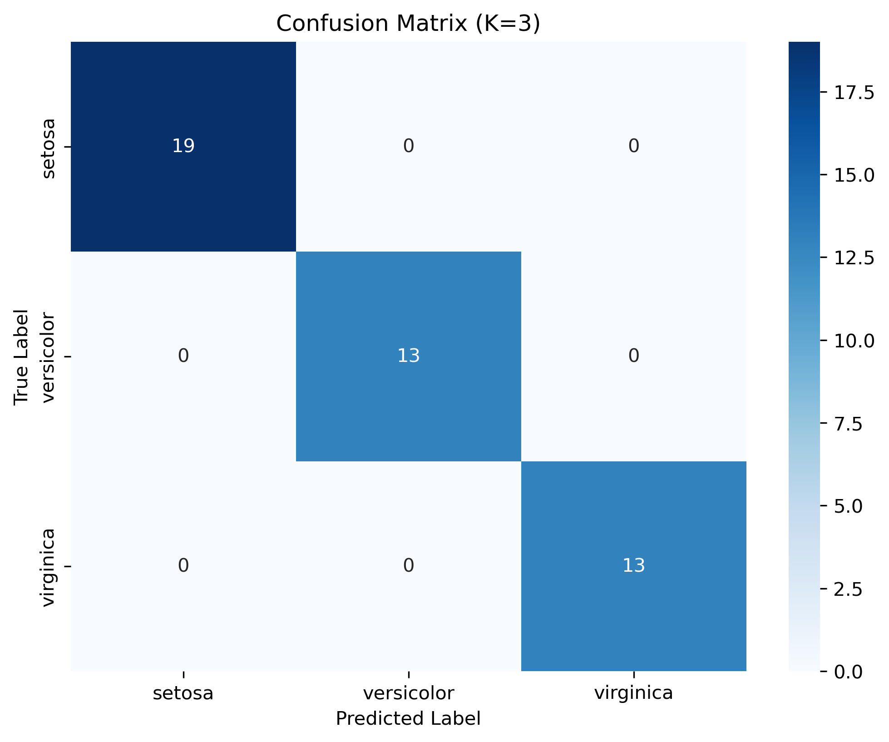

# 🌸 K-Nearest Neighbors (KNN) on Iris Dataset

This project implements the **K-Nearest Neighbors (KNN)** algorithm on the **Iris dataset**, using **petal length** and **petal width** as features for classification.  
It evaluates model performance for different values of **K**, visualizes **confusion matrices**, **decision boundaries**, and plots **accuracy vs K**.

---

## 📂 Project Structure

├── knn_iris.py # Main Python script
├── confusion_matrix_k1.png # Confusion matrix for K=1
├── confusion_matrix_k3.png # Confusion matrix for K=3
├── confusion_matrix_k5.png # Confusion matrix for K=5
├── confusion_matrix_k7.png # Confusion matrix for K=7
├── confusion_matrix_k9.png # Confusion matrix for K=9
├── decision_boundary_k1.png # Decision boundary for K=1
├── decision_boundary_k3.png # Decision boundary for K=3
├── decision_boundary_k9.png # Decision boundary for K=9
├── accuracy_vs_k.png # Accuracy vs K plot
└── README.md # Project documentation

---

---

## 📌 Features

- **Data Preprocessing**
  - Loads the Iris dataset from `scikit-learn`
  - Selects **petal length** and **petal width**
  - Standardizes features with `StandardScaler`
- **Model Training**
  - Trains KNN models with different `K` values
  - Evaluates accuracy on test data
- **Visualization**
  - Confusion matrix heatmaps for each `K`
  - Decision boundaries for selected `K` values
  - Accuracy vs. K value plot
- **Performance Metrics**
  - Accuracy scores
  - Detailed classification report for the best K

---

## 📊 Example Outputs

### Accuracy vs. K Value

### Confusion Matrix (K=3)

### Decision Boundary (K=3)

---

